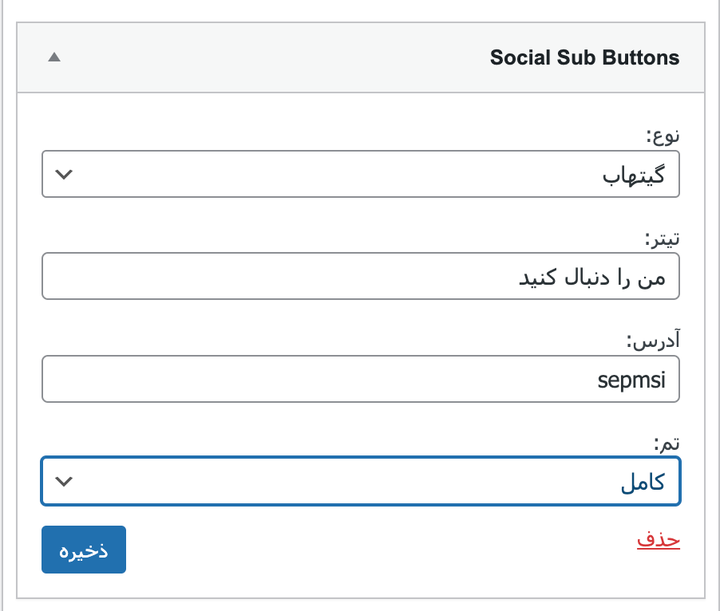

 

  

  <h3 align="center">Social Sub Btn</h3>

  

    WordPress plugin widget to display your YT, Spotify, Github social media accounts for quick follow.
     
     
    <a href="https://github.com/sepmsi/social-sub-btn"><strong>Explore the docs »</strong></a>
     
     
    <a href="https://github.com/sepmsi/social-sub-btn">View Demo</a>
    .
    <a href="https://github.com/sepmsi/social-sub-btn/issues">Report Bug</a>
    .
    <a href="https://github.com/sepmsi/social-sub-btn/issues">Request Feature</a>
  

      

## Table Of Contents

* [About the Project](#about-the-project)
* [Built With](#built-with)
* [Getting Started](#getting-started)
* [Usage](#usage)
* [Contributing](#contributing)
* [License](#license)
* [Authors](#authors)
* [Acknowledgements](#acknowledgements)

## About The Project

WordPress plugin widget to display your YT, Spotify, Github social account for quick follow.

## Built With

* [PHP](https://www.php.net/)
* [WordPress Hooks](https://developer.wordpress.org/plugins/hooks/)

## Getting Started

Here's how to use it:

* copy all contents in wp-plugin/plugins directory
* go to **yourdomain.com/wp-admin/plugins.php**
* activate **Social Sub Button** plugin
* go to **yourdomain.com/wp-admin/widgets.php**
* drag **Social Sub Buttons** widget from left side to your desired section
* fill out all informations
* hit save and enjoy

## Usage

You can display one-click-follow-button for any Spotify url, Github account or YouTube channel to your WordPress website.

## Contributing

Contributions are what make the open source community such an amazing place to be learn, inspire, and create. Any contributions you make are **greatly appreciated**.
* If you have suggestions for adding or removing projects, feel free to [open an issue](https://github.com/sepmsi/social-sub-btn/issues/new) to discuss it, or directly create a pull request after you edit the *README.md* file with necessary changes.
* Please make sure you check your spelling and grammar.
* Create individual PR for each suggestion.
* Please also read through the [Code Of Conduct](https://github.com/sepmsi/social-sub-btn/blob/main/CODE_OF_CONDUCT.md) before posting your first idea as well.

### Creating A Pull Request

1. Fork the Project
2. Create your Feature Branch (`git checkout -b feature/AmazingFeature`)
3. Commit your Changes (`git commit -m 'Add some AmazingFeature'`)
4. Push to the Branch (`git push origin feature/AmazingFeature`)
5. Open a Pull Request

## License

Distributed under the MIT License. See [LICENSE](https://github.com/sepmsi/social-sub-btn/blob/main/LICENSE) for more information.

## Authors

* **Sepehr Mohseni** - *Full-Stack Web Developer* - [Sepehr Mohseni](https://github.com/sepmsi) - *Engineer*

## Acknowledgements

* [Sepehr Mohseni](https://github.com/sepmsi)
